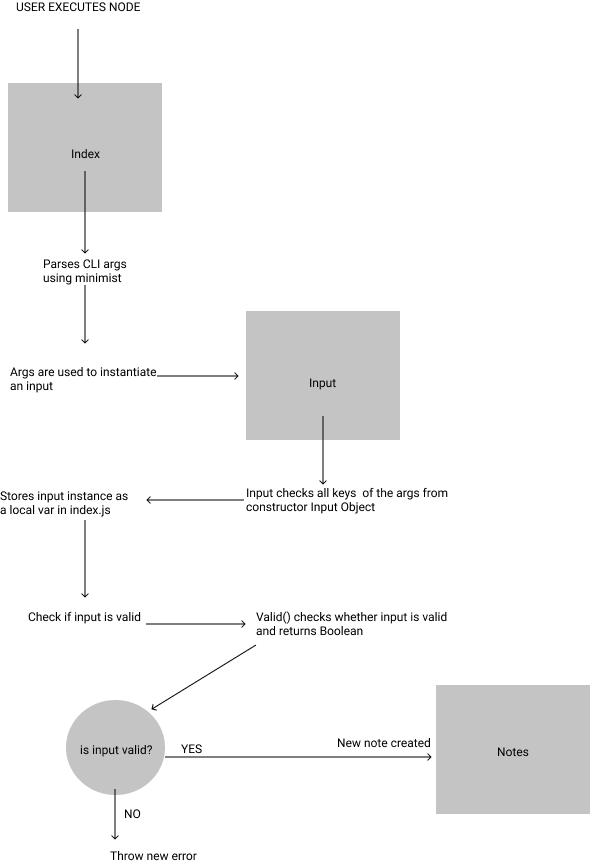

# LAB 1- CLASS 1
## PROJECT: notes

*Author: Riva Davidowski**

**A terminal based (CLI) application allowing users to easily create and manage a list of categorized notes**

**Phase 1 Requirements:**

1. As a user, I want to be able to call the application using command line standard syntax, indicating the text of a note I wish to add so that the system will eventually be able to save this note.
2. As a user, I expect that the application will confirm my intent.

**Phase 2 Requirements:**

1. As a user, I want to be able to call the application using command line standard syntax, indicating the text of a note I wish to add so that the system will eventually be able to save this note.
2. As a user, I expect that the application will confirm my intent.

**Phase 3 Requirements**

Added persistence layer to allow users to save notes to a database, organize them into categories, view, and delete them.

1. As a user, I want my notes to be saved in a database so that I can retrieve them later.
2. As a user, I want to categorize my notes so that I can more easily find them.
3. As a user, I want to be able to see a list of my notes so that I can manage them.
4. As a user, I want to be able to delete a note

**Phase 4 Requirements**

From a business/user perspective, the requirements remain unchanged from the previous lab

1. Users will be able to create and save notes to a database, organize them into categories, view, and delete them.
2. Upon completion of this phase, your Notesy application should be complete and ready for final delivery


-----------------------

## Setup


### How to initialize/run the application:
**The following software is required to be installed on your system:**
- Node.js

 Install npm: `npm i -g` and then use  `npm init`

 - MongoDB

The MongoDB Node.js Driver allows you to easily interact with MongoDB databases from within Node.js applications. You'll need the Driver to connect to your database

 Install MongoDB: `npm install mongodb`

 The easiest way to get started with MongoDB is to use Atlas, MongoDB’s fully-managed database-as-a-service. Check out the docs [here](https://www.mongodb.com/blog/post/quick-start-nodejs-mongodb--how-to-get-connected-to-your-database)

- Minimist

Install minimist: `npm install minimist`

- Load the minimist module:

 `const minimist = require('minimist');`

- The MongoDB module exports MongoClient, and that’s what we’ll use to connect to a MongoDB. Import MongoClient

 `const {MongoClient} = require('mongodb');`

- Load the mongoose module

`const mongoose = require('mongoose');`

### To run:
- On the command line, run:

`node --add or -a 'New Note'`


### How to use your library(n/a)

### Tests:

- Jest (for testing)
`node install  --save-dev jest`

- Load `Supergoose` module
- supergoose is used for connecting to fake Mongo DB in order to make sure that code can connect mongo to test test environment
`const supergoose = require(@code-fellows/supergoose');


**To Run tests, run the commands:**

`npm test input.test.js`
`npm test notes.test.js`

**Add the following section to your package.json:**

```
{
  "scripts": {
    "test": "jest"
  }
}

```


